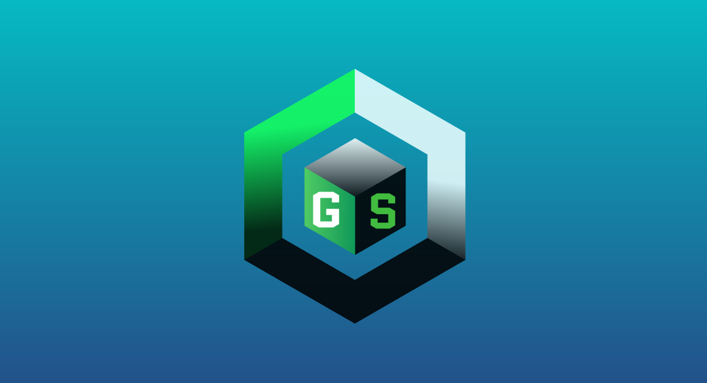

  

  # ProgramaGerman

  
  

   

  <b>ES:</b> Desarrollador informático apasionado por la tecnología y la resolución de problemas. Me enfoco en el desarrollo de software, soporte técnico y soluciones de inteligencia artificial. Con habilidades en lenguajes de programación como Python, Java y JavaScript, así como en desarrollo web y bases de datos. Siempre dispuesto a colaborar y aprender de nuevos proyectos y tecnologías. 
  Venezolano, 21 años, estudiante de Informática.
    
  <b>EN:</b> Computer developer passionate about technology and problem solving. I focus on software development, technical support and artificial intelligence solutions. Skilled in programming languages such as Python, Java and JavaScript, as well as web development and databases. Always willing to collaborate and learn from new projects and technologies. 
  Venezuelan, 21 years old, Computer Science student.

    

  ## Progreso de aprendizaje / Learning Progress

  <table align="center">
    <tr>
      <th>Logo</th>
      <th>Progreso (%)</th>
      <th>Descripción ES</th>
      <th>Description EN</th>
    </tr>
    <tr>
      <td></td>
      <td>65%</td>
      <td>Conocimientos medios, buenas prácticas, sin manejo profundo de memoria.</td>
      <td>Intermediate knowledge, good practices, not deep in memory management.</td>
    </tr>
    <tr>
      <td></td>
      <td>45%</td>
      <td>POO, sin experiencia en entornos gráficos.</td>
      <td>OOP, no experience in graphical environments.</td>
    </tr>
    <tr>
      <td></td>
      <td>30%</td>
      <td>Conocimientos básicos, comprensión general del funcionamiento.</td>
      <td>Basic knowledge, general understanding of how it works.</td>
    </tr>
    <tr>
      <td></td>
      <td>50%</td>
      <td>Manejo de excepciones, control de programa, uso de Springboot. Proceso de avance.</td>
      <td>Exception handling, program control, Springboot usage. In progress.</td>
    </tr>
    <tr>
      <td></td>
      <td>50%</td>
      <td>Conocimientos similares a Java: manejo de excepciones, control de programa, POO, avance constante.</td>
      <td>Similar to Java: exception handling, program control, OOP, steady progress.</td>
    </tr>
    <tr>
      <td></td>
      <td>65%</td>
      <td>Conocimientos medios, buenas prácticas en estructuración y semántica.</td>
      <td>Intermediate knowledge, good practices in structure and semantics.</td>
    </tr>
    <tr>
      <td></td>
      <td>65%</td>
      <td>Conocimientos medios, buenas prácticas en estilos y responsive design.</td>
      <td>Intermediate knowledge, good practices in styles and responsive design.</td>
    </tr>
    <tr>
      <td></td>
      <td>70%</td>
      <td>POO, estructuración y conocimientos funcionales para construir buenos programas.</td>
      <td>OOP, structuring and functional knowledge to build good programs.</td>
    </tr>
    <tr>
      <td></td>
      <td>25%</td>
      <td>Aprendiendo fundamentos y componentes básicos.</td>
      <td>Learning fundamentals and basic components.</td>
    </tr>
    <tr>
      <td></td>
      <td>15%</td>
      <td>Progreso inicial, conocimientos básicos.</td>
      <td>Initial progress, basic knowledge.</td>
    </tr>
    <tr>
      <td></td>
      <td>20%</td>
      <td>Uso básico en proyectos, aprendiendo integración.</td>
      <td>Basic use in projects, learning integration.</td>
    </tr>
  </table>

   

  ## Citas bíblicas / Bible Verses
  <blockquote>
    <b>Josué 1:9</b> 
    <i>"Mira que te mando que te esfuerces y seas valiente; no temas ni desmayes, porque Jehová tu Dios estará contigo en dondequiera que vayas."</i> 
    <b>Joshua 1:9</b> 
    <i>"Have I not commanded you? Be strong and courageous. Do not be afraid; do not be discouraged, for the Lord your God will be with you wherever you go."</i>
  </blockquote>
  <blockquote>
    <b>Proverbios 17:27-28</b> 
    <i>"El que ahorra sus palabras tiene sabiduría; de espíritu prudente es el hombre entendido. Aun el necio, cuando calla, es contado por sabio; el que cierra sus labios es entendido."</i> 
    <b>Proverbs 17:27-28</b> 
    <i>"The one who has knowledge uses words with restraint, and whoever has understanding is even-tempered. Even fools are thought wise if they keep silent, and discerning if they hold their tongues."</i>
  </blockquote>

   

  ## Contacto / Contact
  

    
    
    
    
  

   
  Última edición: 01/07/2025

